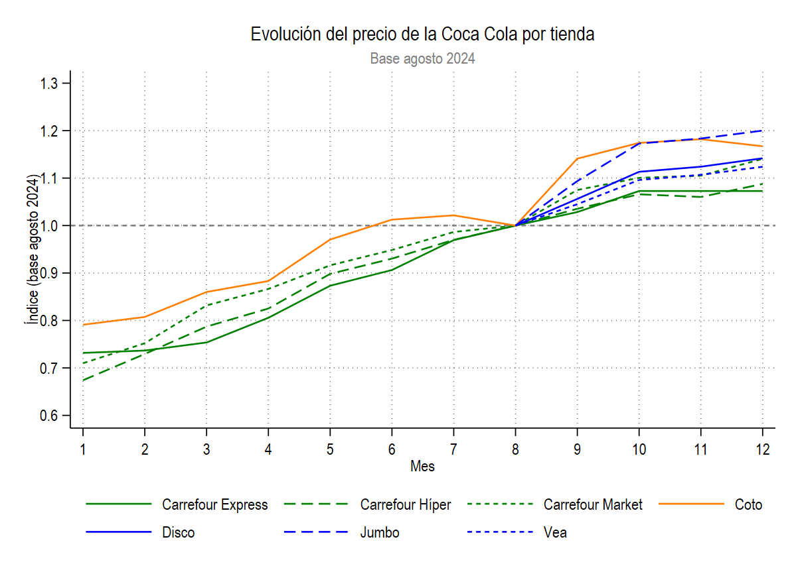

# Ejercicio Práctico Opcional: Precio de la Coca Cola

## Objetivo

Practicar manejo de múltiples archivos, uso de bucles, transformaciones de variables, agregación de datos y visualización de series de precios en Stata.

## Archivos

En la carpeta `bases/` se encuentran:

- 12 archivos dta con los precios de la Coca Cola en diferentes comercios y sucursales para cada mes de 2024: `precios_01.dta` a `precios_12.dta`
- 1 archivo Excel con información de comercios: `comercios.xlsx`

## Consigna

Construir un do-file que resuelva los siguientes puntos.

1. Importar `comercios.xlsx` y guardar esa base temporalmente.
2. Mediante un bucle, unir los 12 archivos mensuales de precios (`precios_01.dta` a `precios_12.dta`) en una sola base.
3. Crear las siguientes variables:
   - `month`: número de mes extraído desde la variable de `mes`.
   - `sucursal_change`: indicador que valga 1 si `desvio_precio_lista` es positivo y 0 en caso contrario (esta variable indica si hubo cambios de precio durante el mes en la sucursal).
   - Renombrar el precio promedio a `precio`.
4. Colapsar la base con el objetivo de disponer de la información a nivel de comercio/bandera/mes en lugar de a nivel sucursal, calculando:
   - el promedio de `precio`.
   - la cantidad de sucursales que cambiaron de precio ese mes.
5. Incorporar la información de comercio y bandera mediante `merge` con la base de comercios.
   - Conservar solo observaciones con match.
   - Crear un identificador numérico `store` a partir de `bandera`.
6. Construir una variable expresando el precio como índice respecto al primer mes disponible de cada `store`.
7. Graficar la evolución mensual del precio indexado para todas las tiendas en un único gráfico, con título, subtítulo, nombres de ejes y leyenda legible.
8. Recalcular el índice usando como base agosto (`month == 8`) para cada `store`.
9.  Volver a graficar la evolución del índice con esta nueva base. Debería resultar algo similar a esto:

10. Crear un gráfico (a elección) que permita comparar los niveles de precios entre las diferentes tiendas.

